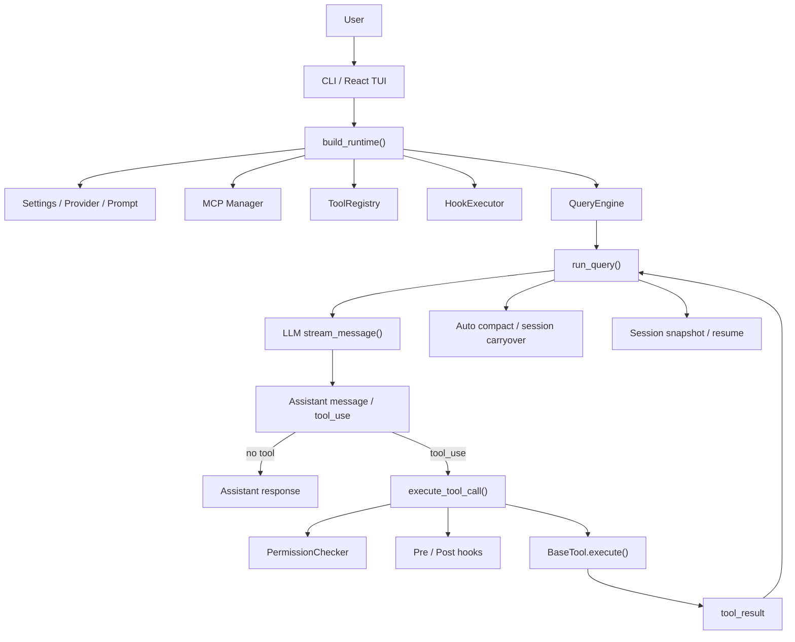
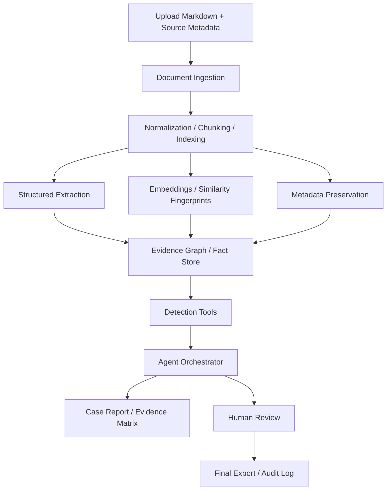

# OpenHarness 架构总结与 Agent 项目复用手册

> 目的：把当前项目沉淀成一份可复用的“知识资产”，既帮助理解 OpenHarness，也帮助下一个 Agent 项目快速落地。  
> 更新时间：2026-04-18  
> 适用场景：阅读 OpenHarness 架构、抽取可复用设计模式、设计“多份投标文件 Markdown 审查 Agent”。

## 1. 先用一句话看懂 OpenHarness

OpenHarness 不是某个具体业务 Agent，而是一个 **Agent Harness**：

- 模型负责决定“下一步做什么”
- Harness 负责提供“怎么做”的基础设施
- 这套基础设施包括：tool loop、权限、hooks、MCP、session、memory、UI、tasks、multi-agent

从这个角度看，OpenHarness 更像一个“Agent 操作系统”或“Agent 运行底座”，而不是一个只会聊天的 Bot。

这也是它最值得复用的地方。

## 2. 这个项目的真实主干架构

如果只抓主干，可以把 OpenHarness 理解成 6 层：

1. 入口层：CLI / TUI / 应用启动
2. 运行时装配层：把 settings、provider、tools、hooks、MCP、engine 拼起来
3. Agent Loop 层：模型流式输出、识别 tool call、执行工具、回填结果
4. 能力层：tools / permissions / hooks / MCP / tasks
5. 状态层：session、compaction、memory、resume
6. 交互层：React TUI、bridge、channels、ohmo

### 2.1 最重要的源码锚点

- 运行时装配：[src/openharness/ui/runtime.py](../src/openharness/ui/runtime.py)
- 会话入口：[src/openharness/engine/query_engine.py](../src/openharness/engine/query_engine.py)
- 核心循环：[src/openharness/engine/query.py](../src/openharness/engine/query.py)
- 工具契约：[src/openharness/tools/base.py](../src/openharness/tools/base.py)
- 默认工具注册：[src/openharness/tools/__init__.py](../src/openharness/tools/__init__.py)
- 权限控制：[src/openharness/permissions/checker.py](../src/openharness/permissions/checker.py)
- Hook 执行器：[src/openharness/hooks/executor.py](../src/openharness/hooks/executor.py)
- MCP 接入：[src/openharness/mcp/client.py](../src/openharness/mcp/client.py)
- 后台任务：[src/openharness/tasks/manager.py](../src/openharness/tasks/manager.py)
- 自动压缩：[src/openharness/services/compact/__init__.py](../src/openharness/services/compact/__init__.py)
- 会话持久化：[src/openharness/services/session_storage.py](../src/openharness/services/session_storage.py)
- 前后端协议：[src/openharness/ui/protocol.py](../src/openharness/ui/protocol.py)
- 系统提示组装：[src/openharness/prompts/system_prompt.py](../src/openharness/prompts/system_prompt.py)
- 配置系统：[src/openharness/config/settings.py](../src/openharness/config/settings.py)

### 2.2 运行流程图



## 3. OpenHarness 最值得复用的设计思路

### 3.1 把“模型决策”与“系统执行”拆开

这是本项目最核心的工程思想。

- 模型只负责规划、选择工具、解释结果
- 系统负责权限、执行、日志、重试、状态、持久化

好处是：

- 更安全：模型不能直接越过权限系统
- 更稳定：工具执行失败时可以被系统显式处理
- 更可测试：工具、权限、状态都能单独测试
- 更可迁移：换模型、不换业务执行底座

### 3.2 Runtime 统一装配，而不是散落初始化

`build_runtime()` 做了非常正确的一件事：把 provider、MCP、tools、hooks、engine、commands 在一个地方组装起来。

这意味着：

- 系统边界清楚
- 测试替身容易注入
- 新能力可插拔

这对任何 Agent 项目都非常重要。不要把“工具注册、模型配置、向量库连接、规则引擎初始化”分散在 12 个文件里。

### 3.3 Tool 是一等公民，且必须是 schema-first

OpenHarness 的工具抽象非常干净：

- `name`
- `description`
- `input_model`
- `execute()`
- `is_read_only()`

这说明一个成熟 Agent 系统，重点不是 prompt 花活，而是：

- 工具边界清不清楚
- 输入 schema 严不严
- 输出是否结构化
- 是否可审计

对你的下一个项目来说，这一点尤其关键，因为“串标围标检查”不能只靠一段 prompt 让模型自由发挥。

### 3.4 权限与业务逻辑分层

`PermissionChecker` 和业务工具是分开的，这非常值得抄。

以后做“投标文件审查 Agent”时，也应该把下面几类约束独立出来：

- 文件/数据访问权限
- 敏感字段访问权限
- 是否允许外网搜索
- 是否允许写结论性报告
- 是否必须人工复核后才能导出正式结论

也就是说，**合规策略不要揉进工具实现里，更不要只揉进 prompt 里**。

### 3.5 Hook 是治理面，不是业务面

OpenHarness 的 hooks 适合做：

- 审计
- 拦截
- 通知
- 额外检查
- 旁路验证

以后你的项目也应该保留这一层，例如：

- 在生成“高风险疑似串标”结论前自动触发二次校验
- 在导出报告前写审计日志
- 在模型使用某些敏感证据时记录 trace

### 3.6 背景任务与对话循环解耦

`BackgroundTaskManager` 的价值很大：有些事情不该堵在前台对话里。

例如：

- 大批量文档解析
- 大规模相似度计算
- 向量索引构建
- 全量 pairwise compare
- OCR / 表格抽取 / 元数据抽取

这些更适合变成异步任务，Agent 只负责：

- 发起任务
- 查询任务状态
- 读取任务结果
- 基于结果继续调查

### 3.7 长上下文不是靠“把所有材料都塞给模型”

OpenHarness 的 compaction 设计说明了一个现实：

- 真正可用的 Agent 必须会处理长会话
- 处理方式不是无限堆上下文
- 而是 checkpoint、summary、carryover、resume

做投标审查时更要注意：

- 文档多
- 比对链路长
- 证据反复引用

所以一定要做“状态对象”和“证据对象”，不要把系统状态全塞在聊天记录里。

### 3.8 MCP / Adapter 模式很适合企业化接入

OpenHarness 通过 `McpClientManager + McpToolAdapter` 把外部能力接入成“像本地工具一样的工具”。

这对下一个项目很有价值：

- OCR 服务
- 企业知识库
- 招采系统
- 风险规则引擎
- 图数据库查询服务
- 相似度计算服务

都可以优先考虑封成 MCP 或统一 Tool API，而不是把所有逻辑写死在主进程里。

## 4. 这个项目给下一个 Agent 项目的最大启发

### 4.1 不要直接做“聊天式投标审查”

你的目标不应该是：

> “上传几份 markdown，让模型聊聊像不像串标围标。”

更合理的目标应该是：

> “构建一个证据驱动的调查系统，Agent 负责规划与解释，工具负责抽取、对比、检索、评分、归档。”

这两者差别非常大。

前者是 Demo。
后者才是能落地的系统。

### 4.2 不要让 LLM 单独产出最终法律式判断

“串标围标”是高风险判断，建议系统输出的是：

- 可疑线索
- 证据链
- 风险等级
- 不确定性说明
- 建议人工复核点

而不是直接替代法务/审标专家做最终定性。

建议系统最终结论使用这类措辞：

- `未发现明显异常`
- `发现需复核的相似性线索`
- `发现中风险可疑关联`
- `发现高风险可疑关联，建议人工复核`

而不是简单输出“是/否串标围标”。

## 5. 你下一个项目应该怎么设计

### 5.1 推荐的总体架构



建议拆成 4 个子系统：

1. 文档与证据底座
2. 检查工具层
3. Agent 编排层
4. 报告与复核层

### 5.2 四个子系统分别做什么

#### A. 文档与证据底座

负责把上传的 Markdown 变成可检索、可比对、可追溯的结构。

至少要有：

- 原文存储
- 文档切片
- bidder / 包号 / 标段 / 文件类型等元数据
- 抽取后的结构化实体
- 相似度索引
- 审计日志

#### B. 检查工具层

负责把“可疑性判断”拆成独立工具，不让模型直接凭空想。

建议工具类别：

- 文档搜索：按 bidder、章节、关键词检索
- 实体抽取：联系人、电话、邮箱、地址、银行账号、报价、日期、品牌、规格
- 片段比对：段落级/表格级/章节级相似度
- 指纹比对：n-gram、模板结构、罕见错别字、格式模式
- 数值规则：报价梯度、尾数规律、极小价差、轮廓异常
- 图查询：共享联系人、共享地址、共享银行账户、共享模板片段
- 证据归档：把线索沉淀成 case/evidence
- 报告生成：只基于已归档证据生成结论

#### C. Agent 编排层

负责调查流程，而不是做重计算。

Agent 的职责应该是：

- 先规划检查路径
- 调工具拿证据
- 发现冲突时回查
- 组织 case
- 生成带证据引用的结论

不要让 Agent 自己：

- 扫全库做 O(n²) 重比对
- 每次临时计算全部 embedding
- 每次重复抽取所有结构化字段

这些应该前置成任务或离线处理。

#### D. 报告与复核层

最终应该输出：

- 风险摘要
- 证据矩阵
- 每条证据的来源位置
- 模型判断依据
- 规则引擎命中的规则
- 不确定性与缺失信息
- 审核人复核入口

### 5.3 一个真正可落地的数据模型

建议至少定义这些核心对象：

### DocumentRecord

- `doc_id`
- `project_id`
- `bidder_id`
- `document_type`
- `source_filename`
- `source_sha256`
- `upload_time`
- `markdown_text`
- `source_metadata`

### SectionChunk

- `chunk_id`
- `doc_id`
- `section_path`
- `text`
- `token_count`
- `embedding_id`
- `fingerprints`

### ExtractedFact

- `fact_id`
- `doc_id`
- `bidder_id`
- `fact_type`
- `value`
- `normalized_value`
- `source_chunk_id`
- `confidence`

### EvidenceItem

- `evidence_id`
- `case_id`
- `evidence_type`
- `left_ref`
- `right_ref`
- `score`
- `why_it_matters`
- `raw_metrics`

### SuspicionCase

- `case_id`
- `project_id`
- `bidders_involved`
- `risk_level`
- `status`
- `evidence_ids`
- `review_notes`

### 5.4 一个更适合该场景的工作流

推荐使用“预处理 + 调查”双阶段：

### 阶段 1：预处理

- 上传 Markdown
- 保存原文和元数据
- 切 chunk
- 做实体抽取
- 做 embedding
- 做模板/文本/报价等初步指纹
- 生成候选可疑 pair

### 阶段 2：调查

- Agent 接到“检查某个项目是否存在串标围标风险”
- 先读取候选 pair
- 对高风险 pair 调用更细的对比工具
- 把证据存成 case
- 由报告工具基于 case 生成结论

这样做的好处是：

- 前台响应快
- 成本可控
- 证据结构稳定
- 更容易做审计和复核

### 5.5 这个场景最容易被忽略的一个点

如果你只上传“Markdown 文本”，很多高价值线索可能已经丢了：

- 原始文件作者信息
- 生成器/模板信息
- PDF / Word 元数据
- 附件层级
- 表格布局痕迹
- 提交时间与上传路径

所以推荐上传协议至少包含两部分：

1. Markdown 正文
2. sidecar metadata

例如：

```json
{
  "project_id": "P-2026-001",
  "bidder_id": "BIDDER_A",
  "document_type": "technical_bid",
  "source_filename": "A_company_technical.docx",
  "source_file_type": "docx",
  "source_sha256": "...",
  "source_metadata": {
    "author": "...",
    "created_at": "...",
    "last_modified_at": "...",
    "template": "...",
    "pages": 32
  },
  "markdown_text": "..."
}
```

这一步非常重要，否则很多“共享模板/共享作者/共享生成路径”的线索会永久消失。

## 6. 推荐的 Agent 结构：先单 Agent，后多 Agent

### 6.1 V1 不建议一开始就上复杂多 Agent

更推荐：

- 一个主调查 Agent
- 一组强工具
- 一个结构化 evidence store
- 一个独立 report builder

原因很简单：

- 这个场景的难点首先是“证据抽取与比对”
- 不是“让很多 Agent 聊天协作”

如果工具层不稳，多 Agent 只会放大噪声。

### 6.2 什么时候升级到多 Agent

当下面三件事已经稳定后，再考虑多 Agent：

1. 文档抽取准确率稳定
2. 证据对象模型稳定
3. 单 Agent 可以稳定完成一条案件链路

这时再拆成：

- `planner_agent`：决定调查顺序
- `extraction_agent`：抽证据
- `comparison_agent`：做相似性/规则分析
- `review_agent`：检查证据是否充分
- `report_agent`：只负责写报告

我更推荐的模式是：

- **manager 保持最终控制权**
- specialist 只做有边界的子任务

这和 OpenHarness 的 tool / agent / task 分层是一致的。

## 7. 工具层应该怎么设计

### 7.1 先做“可复用工具”，不要先写“万能 prompt”

建议优先落地这些工具：

### 检索类

- `search_chunks(project_id, keyword, bidder_id?, top_k?)`
- `search_similar_chunks(chunk_id, top_k?)`
- `list_project_documents(project_id)`

### 抽取类

- `extract_bid_entities(doc_id, schema_name)`
- `extract_bid_prices(doc_id)`
- `extract_contacts(doc_id)`

### 比对类

- `compare_documents(doc_a, doc_b, mode)`
- `compare_sections(section_a, section_b)`
- `compare_price_patterns(project_id)`

### 图谱类

- `query_shared_entities(project_id, entity_type, value?)`
- `find_bidder_links(project_id, bidder_a, bidder_b)`

### 证据管理类

- `create_case(project_id, bidders)`
- `append_evidence(case_id, evidence_payload)`
- `list_case_evidence(case_id)`

### 报告类

- `generate_case_report(case_id, format)`

### 7.2 工具输出必须结构化

不要让工具只返回一大段自然语言。

更推荐返回：

- 结构化字段
- 原文引用
- 来源 chunk/doc
- 数值分数
- 可疑原因标签

例如：

```json
{
  "match_score": 0.91,
  "evidence_type": "paragraph_similarity",
  "left": {
    "doc_id": "doc_a",
    "section_path": "3.2.1",
    "excerpt": "......"
  },
  "right": {
    "doc_id": "doc_b",
    "section_path": "3.2.1",
    "excerpt": "......"
  },
  "why_flagged": "罕见术语与句式高度重合"
}
```

这样 Agent 更容易推理，也更容易审计。

## 8. 推荐的实现路径

### 8.1 一个务实的 V1

建议 V1 先做成：

- Web API + 后台任务
- 文档上传与预处理
- evidence store
- 单调查 Agent
- 报告导出

先不要做：

- 复杂实时聊天 UI
- 过多多 Agent
- 过早全自动外网搜证
- 过度“类人”对话体验

先把“证据闭环”做出来。

### V1 的验收标准

- 能上传多份 markdown
- 能输出候选风险 pair
- 能把关键相似片段和共享实体列出来
- 能给出带引用的风险摘要
- 能保存调查过程和最终 case

### 8.2 V2 再补强

V2 可以再加：

- 人工复核工作台
- 多 Agent 专家分工
- 更细的图数据库查询
- 更多规则引擎
- 项目级历史记忆
- 评测集与回归集

## 9. 我建议参考的框架与原因

下面这部分带有“选型建议”属性，属于我结合你的场景做的工程推断；框架信息已在 **2026-04-18** 查阅各自官方文档。

### 9.1 第一参考：OpenHarness 本身

最适合学习的是它的“底座思路”，不是直接照搬业务。

最值得抄的模块：

- runtime 装配
- agent loop
- tool registry
- permissions
- hooks
- MCP adapter
- tasks
- session / compact / resume

如果你要自己做一个可控 Agent 后端，这个仓库本身就是很好的架构参考。

### 9.2 第二参考：PydanticAI

适合你如果：

- 想用 Python
- 希望工具与输出强类型
- 希望 structured output 很稳
- 想渐进式从单 Agent 升级到 multi-agent

官方文档强调了 5 种复杂度层级，从单 Agent、代理委派、程序化 handoff、graph 控制流，到 deep agents；并且提供 durable execution 能力。  
参考：

- [PydanticAI Multi-Agent Patterns](https://pydantic.dev/docs/ai/guides/multi-agent-applications/)
- [PydanticAI Durable Execution](https://pydantic.dev/docs/ai/integrations/durable_execution/overview/)

我的判断：如果你要做“证据对象 + 结构化输出 + Python 后端”，它非常合适。

### 9.3 第三参考：LangGraph

适合你如果：

- 需要长流程、可恢复、可中断
- 需要 human-in-the-loop
- 需要明确 state graph
- 需要调查流程是“有状态工作流”，不是单轮工具调用

官方文档把 LangGraph定位成 low-level orchestration framework，重点能力就是 durable execution、persistence、human-in-the-loop。  
参考：

- [LangGraph Overview](https://docs.langchain.com/oss/python/langgraph/overview)
- [LangGraph Persistence](https://docs.langchain.com/oss/python/langgraph/persistence)

我的判断：如果你的审查流程要支持“暂停调查、人工补证、继续执行”，LangGraph 会比纯 prompt loop 更合适。

### 9.4 第四参考：OpenAI Agents SDK

适合你如果：

- 你准备深度使用 OpenAI 生态
- 想使用 hosted tools
- 想利用 handoffs / agents-as-tools / results/state / guardrails / traces
- 想把工具、编排、评测都放在同一套官方语义里

官方资料里明确把能力分成：agent definitions、orchestration、guardrails、results/state、integrations/observability、evaluation；还支持 file search。  
参考：

- [OpenAI Agents SDK Overview](https://developers.openai.com/api/docs/guides/agents)
- [OpenAI Agents SDK Agent Orchestration](https://openai.github.io/openai-agents-python/multi_agent/)
- [OpenAI File Search](https://developers.openai.com/api/docs/guides/tools-file-search)

我的判断：如果你要“一个 manager agent 控最终回答，多个 specialist 做 bounded subtask”，官方文档里的 `agents as tools` 模式非常适合你的场景。

### 9.5 第五参考：AutoGen

适合你如果：

- 你一开始就确定要做复杂多 Agent
- 系统偏事件驱动
- 需要更强的异步消息与分布式扩展

AutoGen Core 官方文档强调 actor model、asynchronous messaging、distributed/scalable/resilient agent systems。  
参考：

- [AutoGen Core](https://microsoft.github.io/autogen/stable/user-guide/core-user-guide/index.html)

我的判断：它更适合复杂多智能体系统，不一定是你这个项目的最佳起步点，但适合后期进化。

### 9.6 第六参考：CrewAI

适合你如果：

- 你更想快速搭建“flow + crew”式工作流
- 你想先快速出一个多 Agent 业务样机
- 你接受更强的框架意见

官方文档主打 crews、flows、guardrails、memory、knowledge、observability。  
参考：

- [CrewAI Docs](https://docs.crewai.com/)

我的判断：适合快速搭 demo 或流程编排，但如果你非常在意底层可控性，可能不如 OpenHarness / PydanticAI / LangGraph 那样贴合“证据型系统”的长期演进。

## 10. 针对你的场景，我会怎么选

### 方案 A：最推荐的务实路线

- 后端框架：常规 Python API 服务
- Agent 层：`PydanticAI` 或 `OpenAI Agents SDK`
- 工作流层：先不用复杂 graph
- 存储层：关系库 + 向量索引 + 对象存储
- 证据层：结构化 fact/evidence/case
- 任务层：异步预处理与比对任务

适合：

- 尽快做出可信的 V1
- 强调证据闭环
- 先把工具层做稳

### 方案 B：如果你明确要“可暂停、可恢复、人工复核后继续”

- 后端框架：常规 Python API 服务
- Agent / 工作流：`LangGraph`
- 工具：本地 tool / MCP / 检索服务
- 状态：thread + checkpoint + case store

适合：

- 调查过程长
- 审核人会多次介入
- 需要流程级恢复

### 方案 C：如果你要一个更像 OpenHarness 的“Agent 平台”

- 仿照 OpenHarness 自建 harness
- 保留 runtime / tools / permissions / hooks / tasks / session / compact
- 在上面挂你的审查业务工具

适合：

- 你不只是做一个投标审查项目
- 你未来还会做别的 Agent 业务
- 你要的是“平台底座”，不是“单个 workflow”

## 11. 我建议你直接复用的一套目录结构

```text
src/
  app/
    api.py
    dependencies.py
  agent/
    runtime.py
    prompts.py
    state.py
    orchestrator.py
    tools/
      doc_search.py
      entity_extract.py
      section_compare.py
      price_rules.py
      graph_query.py
      case_store.py
      report_writer.py
    workflows/
      single_investigator.py
      review_loop.py
  domain/
    documents/
      models.py
      ingest.py
      chunking.py
    evidence/
      models.py
      builder.py
      scoring.py
    detectors/
      text_similarity.py
      template_fingerprint.py
      shared_entities.py
      quote_anomalies.py
  infra/
    storage/
    vector/
    db/
    queue/
    mcp/
  tasks/
    preprocess_project.py
    rebuild_indices.py
  evals/
    golden_cases/
    runners/
  tests/
```

这套结构的原则是：

- `agent/` 负责编排
- `domain/` 负责业务模型与规则
- `infra/` 负责技术底座
- `tasks/` 负责重处理
- `evals/` 负责回归质量

## 12. 最后给你的结论

如果你下一个项目要做：

> 上传多个投标文件 markdown，让 agent 结合多个工具自主检查并输出串标围标风险结果

那么最好的路线不是“做一个会聊天的 Agent”，而是：

1. 先做一个证据驱动的文档审查系统
2. 把抽取、检索、比对、规则、归档做成工具
3. 让 Agent 站在工具之上做调查与解释
4. 最终输出 case + evidence + risk level + uncertainty
5. 对高风险结论保留人工复核

OpenHarness 给你的最大启发不是某个单独模块，而是这一整套分层思想：

- Agent loop 要薄
- 工具要强
- 权限要独立
- 状态要持久
- 外部能力要适配
- 业务结论要证据化

如果你只记住一句话，我建议记这句：

> **高风险 Agent 项目，核心不是“让模型更聪明”，而是“让证据链、工具链、状态链足够可靠”。**
