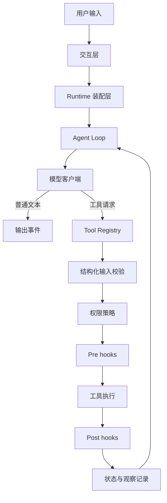
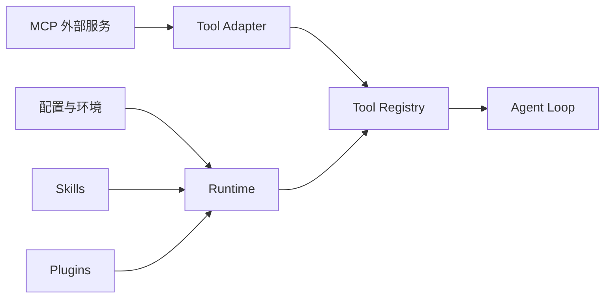
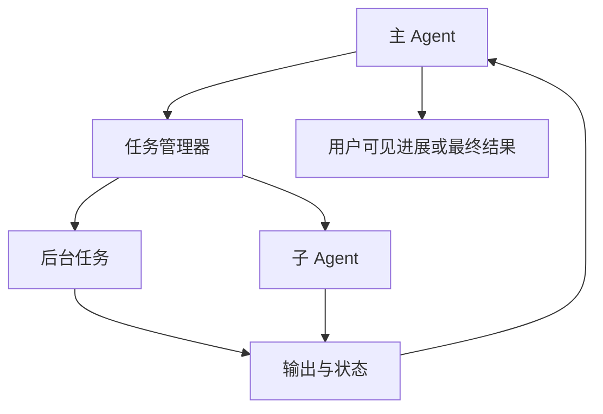
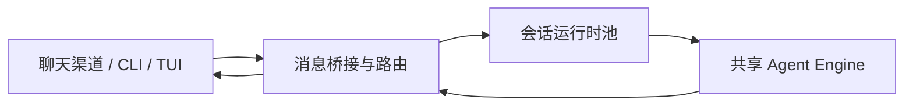

# Agent Harness 设计方法论知识资产

> 目的：从本项目中提炼可迁移的 Agent 系统设计方法，而不是复述实现或编写项目说明书。  
> 抽象层级：保留模块职责、关键协作关系和设计取舍，去掉参数、字段、敏感配置和强项目绑定细节。  
> 适用对象：后续需要设计可执行、可治理、可扩展、可长期运行的 Agent 项目。

## 1. 这个架构真正解决的问题

很多 Agent 项目的失败点不在模型不够强，而在“模型周围没有足够可靠的运行底座”：

- 模型能想，但不能安全、稳定、可审计地执行。
- 工具很多，但缺少统一契约，最后变成不可测试的 prompt 拼接。
- 上下文越来越长，但状态没有沉淀，长任务一压缩就丢失关键线索。
- 能力扩展靠改主流程，导致工具、知识、权限、UI、外部服务互相缠绕。
- 多 Agent 很早引入，但任务边界、证据交接和失败处理没有设计，协作反而放大噪声。

本项目的核心方法论可以概括为：

> 把 LLM 放在“决策与解释”的位置，把 Harness 放在“执行、治理、记忆、扩展、观察”的位置。

也就是说，Agent 项目不要只问“模型如何回答”，而要先设计：

- 模型可以看到什么。
- 模型可以请求什么动作。
- 哪些动作必须被系统拦截、校验、记录或转交。
- 哪些状态必须离开聊天记录，变成可恢复、可复核的系统状态。
- 哪些能力应该是内置工具，哪些应该是外部适配器，哪些只是按需加载的知识。

## 2. 总体设计思想：模型决策与系统执行分离

项目最值得迁移的设计不是某个具体工具，而是职责边界。

模型负责：

- 理解用户意图。
- 规划下一步。
- 选择工具。
- 阅读工具结果。
- 解释进展和产出结论。

Harness 负责：

- 组装运行时依赖。
- 暴露工具契约。
- 校验工具输入。
- 执行权限策略。
- 触发生命周期治理。
- 记录会话、任务、压缩和恢复状态。
- 把外部服务适配成统一能力。
- 向不同 UI 或消息渠道输出事件。

这个拆分带来的直接收益是：

- 安全边界不依赖模型自觉。
- 工具失败可以被系统显式表达，而不是混在自然语言里。
- 核心流程可以被测试，外部能力可以被替换。
- 更换模型、UI、渠道、工具来源时，不需要重写 Agent 的运行逻辑。

## 3. 可迁移的模块拆分方法

下面的模块不是项目目录清单，而是 Agent 系统中可复用的职责分层。

| 模块 | 解决的问题 | 设计原因 | 可迁移经验 |
| --- | --- | --- | --- |
| Runtime 装配层 | 初始化散落、依赖关系不清 | 把模型客户端、配置、工具、权限、hooks、MCP、会话和 UI 状态集中装配 | 为每个 Agent 项目设置一个 composition root，其他模块只接收已装配好的依赖 |
| Agent Loop 层 | 模型输出与工具执行难以闭环 | 用事件化循环承接“模型请求工具、系统执行、结果回填、模型继续判断” | 把 Agent 视为状态机，而不是一次性问答函数 |
| Tool 能力层 | 动作边界模糊、输入不可控 | 工具必须有名称、说明、结构化输入、执行结果和只读语义 | 先设计工具契约，再设计 prompt |
| Governance 层 | 权限和审计混入业务逻辑 | 权限检查与 hooks 独立于工具实现 | 策略不要写死在 prompt 或工具内部，应作为横切治理面 |
| Context 与 Memory 层 | 长任务丢状态、恢复困难 | 将会话、近期工作、压缩检查点、持久记忆分层保存 | 聊天记录不是数据库，关键状态必须外化 |
| Extension 层 | 扩展能力需要改核心代码 | Skills、plugins、MCP 等通过统一入口注入能力 | 区分知识扩展、动作扩展、流程扩展和外部服务扩展 |
| Task 与 Multi-Agent 层 | 长耗时任务阻塞对话，多 Agent 缺少生命周期 | 后台任务、子 Agent、团队协作都需要状态、输出和终止机制 | 多 Agent 不是聊天群，而是带边界的任务执行网络 |
| Interaction 层 | CLI、TUI、远程渠道各自实现一套 Agent | UI 和消息渠道只处理输入输出，核心运行时保持共享 | 把传输层和推理执行层拆开，避免渠道绑定业务逻辑 |
| Provider 与 Config 层 | 模型供应商差异污染核心流程 | 通过 provider/profile/settings 归一化模型、鉴权和默认行为 | 模型供应商是边缘适配问题，不应成为业务核心分支 |

## 4. 关键协作关系

### 4.1 一次 Agent 行动的标准链路

这条链路的设计重点不是“工具怎么执行”，而是每个环节都有独立责任：

- Agent Loop 不关心工具来源，只关心工具是否符合统一契约。
- 工具不决定自己是否被允许执行，权限层统一判断。
- hooks 不承担主业务，只负责拦截、审计、旁路验证或通知。
- 状态层记录的是可恢复信息，而不是把所有细节塞回 prompt。

### 4.2 能力注入的协作关系

这里的关键原则是“能力可以来自不同地方，但进入核心循环前必须被归一化”。  
本地工具、插件工具和外部 MCP 工具在执行链路里不应拥有不同特权，否则治理和测试都会失效。

### 4.3 长任务与多 Agent 的协作关系

这类协作的重点是主 Agent 保持最终控制权：

- 子任务要有明确目标和边界。
- 子任务输出要能被主 Agent 消化，而不是直接替代主 Agent 决策。
- 长耗时工作要能查询、停止、恢复或读取尾部输出。
- 多 Agent 的价值来自并行和专业化，不来自“让多个模型自由讨论”。

### 4.4 渠道与运行时的协作关系

这种拆分让同一个 Agent 内核可以服务不同入口：

- CLI 面向本地开发。
- TUI 面向交互控制。
- 远程聊天渠道面向长期陪伴和异步协作。

入口变化不应该改变 Agent 的工具治理、记忆策略和执行语义。

## 5. 重要设计原则与决策逻辑

### 5.1 Tool-first，而不是 prompt-first

当一个能力满足任意条件时，应优先设计为工具：

- 需要访问外部系统。
- 需要读写文件或执行命令。
- 需要结构化输入输出。
- 需要权限控制或审计。
- 会被多次复用。
- 失败需要明确表达。

Prompt 适合处理理解、规划、归纳和解释。  
Tool 适合处理动作、检索、计算、验证和持久化。

一个成熟 Agent 项目的核心不是“更长的系统提示词”，而是“更清晰的动作表面”。

### 5.2 Policy-outside-business

权限、敏感路径保护、命令限制、人工确认、审计记录，都不应该散落在业务工具中。  
这些能力属于治理面，应该围绕工具执行链路统一生效。

这样做的原因是：

- 工具作者不必重复实现安全规则。
- 新工具上线后自动继承基础治理。
- 策略可以按模式切换，例如计划、默认、自动执行。
- 审计和安全测试有稳定入口。

迁移到其他 Agent 项目时，可以把治理面设计为“所有动作的前置门”和“所有结果的后置观察点”。

### 5.3 Runtime 作为组合根

Runtime 的价值在于把系统复杂性收拢到一个装配边界：

- 读取配置。
- 解析当前工作区。
- 建立模型客户端。
- 加载插件与技能。
- 连接外部服务。
- 注册工具。
- 创建权限检查器。
- 创建 hooks 执行器。
- 建立会话状态。
- 生成系统提示。

其他模块不需要知道这些对象如何创建，只需要依赖稳定接口。  
这降低了测试难度，也避免了“每个入口各自初始化一套不一致运行时”的问题。

### 5.4 统一工具契约吸收异构能力

本地工具、外部 MCP 服务、插件扩展、后台任务入口，本质都可以被抽象成“模型可请求的能力”。  
关键是进入核心循环前统一为同一种工具契约：

- 能被模型发现。
- 能被 schema 描述。
- 能被输入校验。
- 能被权限层拦截。
- 能产生规范化结果。
- 能进入相同的事件与日志链路。

这是一种强迁移经验：不要让外部服务直接侵入 Agent Loop。  
先适配，再注册，再统一治理。

### 5.5 长上下文治理要分层

长任务不能只依赖上下文窗口。更稳妥的做法是把状态分成多层：

- 当前对话：保留模型正在处理的近期上下文。
- 工具观察：记录最近读过、改过、验证过的关键事实。
- 会话快照：支持恢复和继续。
- 压缩摘要：在上下文过长时保留任务骨架。
- 持久记忆：保存跨会话仍然有价值的偏好、规则或项目知识。

判断逻辑：

- 临时推理材料留在对话中。
- 后续步骤会依赖的事实进入 carryover 状态。
- 跨轮次或跨天任务需要会话快照。
- 跨项目或长期偏好才进入持久记忆。

### 5.6 Hooks 是治理面，不是业务主流程

Hooks 适合做横切能力：

- 工具调用前的阻断。
- 工具调用后的审计。
- 风险提示。
- 旁路验证。
- 通知和外部同步。

Hooks 不适合承载主业务逻辑。  
如果一个 hook 开始决定业务流程本身，就应该考虑把它提升为显式工具、命令或服务。

### 5.7 Skills 与 Plugins 的不同定位

Skills 是“按需知识”。  
适合放置领域规则、操作手册、风格指南、排错流程和人类经验。

Plugins 是“可打包扩展”。  
适合组合命令、技能、hooks、agent 定义和外部服务配置。

可迁移决策：

- 只是告诉 Agent 如何做，用 skill。
- 要提供新的动作，用 tool。
- 要绑定一组能力并分发，用 plugin。
- 要接入外部系统，用 MCP 或工具适配器。
- 要改变生命周期行为，用 hook。

### 5.8 先单 Agent 稳定，再引入多 Agent

多 Agent 不是架构起点，而是扩展手段。  
在工具契约、状态模型、验证方式还不稳定时，多 Agent 通常会放大不确定性。

适合引入多 Agent 的条件：

- 子任务可以独立完成。
- 输出格式能被主 Agent 验收。
- 任务之间写入边界清楚。
- 失败可以被隔离。
- 并行能显著缩短耗时或提高质量。

不适合引入多 Agent 的情况：

- 只是因为任务看起来复杂。
- 需要多个 Agent 共同猜测需求。
- 核心证据还没有结构化。
- 子任务结果无法验证。

### 5.9 交互层应事件化，而不是直接拼字符串

Agent 的执行过程中会出现多种事件：

- 模型文本增量。
- 工具开始。
- 工具完成。
- 权限请求。
- 压缩进度。
- 任务状态。
- 错误。
- 最终完成。

如果 UI 或渠道直接等待一个完整字符串，就会丢失交互性和可观察性。  
事件化协议让 CLI、TUI、远程聊天渠道可以共享同一个核心运行时，同时按照各自能力展示进度、审批和结果。

### 5.10 Provider 是边界适配，不是核心架构

不同模型供应商会带来鉴权、消息格式、工具调用格式、流式事件和默认模型的差异。  
这些差异应该被 provider adapter 吸收，核心引擎只面对统一的 streaming message 能力。

迁移原则：

- 核心消息结构保持稳定。
- provider 负责格式转换。
- provider registry 负责发现、标签和默认行为。
- 业务模块不依赖某个供应商的私有字段。

## 6. 适合迁移到其他 Agent 项目的经验

### 6.1 把 Agent 设计成“运行系统”，不是“聊天入口”

一个可靠 Agent 至少需要：

- 可执行的工具层。
- 可治理的权限层。
- 可恢复的状态层。
- 可扩展的能力层。
- 可观察的事件层。
- 可替换的模型层。

只做聊天入口，短期容易出 demo，长期难以沉淀能力。

### 6.2 每个模块都要有自己的“不负责”

好的模块拆分不只是定义职责，也要定义边界：

- Engine 不负责业务工具细节。
- Tool 不负责权限策略。
- Hook 不负责主流程决策。
- Skill 不负责执行副作用。
- Plugin 不绕过核心治理。
- UI 不持有业务状态。
- Provider 不影响业务语义。
- Memory 不保存无筛选的全部上下文。

这些“不负责”比职责列表更能防止系统腐化。

### 6.3 用统一执行链路降低扩展成本

扩展越多，越需要统一入口。  
如果每种能力都有自己的执行方式，就会出现安全、日志、错误处理和测试的分裂。

更稳的策略是：

- 所有动作都先变成工具。
- 所有工具都走同一条校验、权限、hook、执行、记录链路。
- 所有外部服务都先适配，再进入工具注册表。
- 所有 UI 都消费同一种事件模型。

### 6.4 状态必须被设计，而不是顺手保存

Agent 项目常见问题是“什么都放聊天记录里”。  
更可迁移的做法是给状态分类型：

- 意图状态：当前目标、下一步、未解决问题。
- 观察状态：读过的文件、外部查询、工具结果摘要。
- 工作状态：待办、后台任务、子 Agent 进度。
- 验证状态：已运行检查、已确认事实、已知风险。
- 记忆状态：跨会话仍有用的规则和偏好。

不同状态有不同保留周期和展示方式，不能全部混在 prompt 里。

### 6.5 多入口共享内核

CLI、TUI、HTTP、Slack、飞书、Telegram 等入口只是 transport。  
它们可以有不同交互体验，但不应该拥有不同的 Agent 语义。

迁移到新项目时，应优先设计：

- 一个核心 Runtime。
- 一个核心 Engine。
- 一套工具治理链路。
- 多个薄入口适配器。

这样入口越多，系统复用率越高。

### 6.6 测试应围绕契约和不变量

Agent 项目的测试不应只验证“模型回答像不像”。  
更应该验证：

- 工具 schema 是否稳定。
- 权限模式是否按预期阻断或放行。
- hooks 是否能拦截和记录。
- provider adapter 是否生成统一消息。
- 会话恢复是否保留关键状态。
- 压缩后是否保留任务骨架。
- 外部服务失败是否被规范化表达。
- UI 协议事件是否完整。

这些测试不会保证模型永远正确，但能保证 Harness 不把错误放大。

## 7. 常见反模式

### 7.1 用超长 prompt 替代工具层

表现：

- 所有规则都写进系统提示。
- 模型被要求自己检索、计算、判断和记录。
- 没有结构化证据，也没有可复查动作。

后果：

- 难以测试。
- 难以审计。
- 长任务容易遗忘。
- 换模型后行为漂移严重。

### 7.2 让工具自己处理权限

表现：

- 每个工具内部各自判断是否安全。
- 某些工具忘记加限制。
- 新工具绕过审批和审计。

后果：

- 安全策略碎片化。
- 权限模式无法全局切换。
- 审计结果不完整。

### 7.3 外部服务直接进入主流程

表现：

- Agent Loop 直接知道某个外部服务的细节。
- 服务断开导致核心流程异常。
- 无法把外部工具和本地工具统一治理。

更好的做法：

- 外部服务由 manager 维护连接。
- 通过 adapter 转成统一工具。
- 断连和错误被规范化为工具结果。

### 7.4 过早多 Agent

表现：

- 还没有清晰工具和状态，就让多个 Agent 分头行动。
- 子 Agent 输出不可验证。
- 多个 Agent 同时写同一区域。

后果：

- 结果冲突。
- 调试困难。
- 责任不清。

### 7.5 把 UI 当业务层

表现：

- CLI、TUI、远程聊天渠道各自实现流程。
- 权限弹窗、任务状态、工具结果在不同入口行为不一致。

后果：

- 功能无法复用。
- Bug 修复需要多处同步。
- 新渠道接入成本过高。

## 8. 面向新 Agent 项目的架构取舍表

| 设计问题 | 优先选择 | 何时换方案 |
| --- | --- | --- |
| 规则写 prompt 还是做工具 | 可重复、可验证、需外部访问的能力做工具 | 只涉及表达风格或一次性解释时用 prompt |
| 能力做内置工具还是 MCP | 核心本地动作做内置工具 | 独立服务、企业系统、跨项目能力用 MCP 或外部 adapter |
| 逻辑放 hook 还是 tool | 审计、拦截、通知放 hook | 产生业务结果或改变主流程时放 tool |
| 先做单 Agent 还是多 Agent | 默认单 Agent 加强工具层 | 子任务独立、可验证、并行收益明确时拆多 Agent |
| 状态放聊天记录还是持久层 | 临时推理放聊天记录 | 会被恢复、审计、复用的状态进入持久层 |
| UI 直接调用工具还是调用 Engine | UI 调 Engine 或 Runtime | 只有纯管理后台动作才可绕过 Agent Loop |
| provider 逻辑放业务里还是 adapter | 放 provider adapter | 业务确实依赖某模型独有能力时，也要隔离为能力开关 |
| 长任务同步等结果还是后台化 | 默认后台化并提供状态查询 | 极短、无副作用、无需进度反馈的任务可同步 |

## 9. 给后续 Agent 项目的设计指导原则

这一节把前面的方法论转化为可执行指导，适用于新 Agent 项目的架构设计、模块拆分、协作关系设计和方案取舍。

### 9.1 架构设计原则

1. 先定义 Agent 的动作边界，再写系统提示词。
2. 把模型视为决策者，把 Harness 视为执行系统。
3. 所有可执行动作必须经过统一工具契约。
4. 所有工具调用必须经过统一治理链路。
5. Runtime 必须成为唯一组合根，避免入口各自初始化依赖。
6. Provider、UI、外部服务都属于边界适配，不应污染核心业务语义。
7. 长任务必须有状态、进度、输出和终止机制。
8. 长上下文必须通过状态分层解决，不要只依赖更大的上下文窗口。

### 9.2 模块拆分原则

新项目可以按以下职责拆分，而不必照搬本项目目录：

- `runtime`：装配配置、模型、工具、权限、hooks、外部服务和会话。
- `engine`：维护消息、事件和工具循环。
- `tools`：封装所有可执行能力，提供 schema、只读语义和规范化结果。
- `policy`：集中处理权限、敏感资源、人工确认和执行模式。
- `hooks`：承载审计、拦截、通知、旁路验证等横切逻辑。
- `memory`：管理会话快照、压缩摘要、近期工作状态和持久记忆。
- `extensions`：管理技能、插件、外部能力包和按需知识。
- `tasks`：管理后台任务、子 Agent、长耗时流程和输出读取。
- `providers`：屏蔽模型供应商差异。
- `interfaces`：承接 CLI、TUI、HTTP、聊天渠道等入口。
- `tests`：覆盖工具契约、权限不变量、状态恢复、事件协议和 adapter 行为。

拆分时保持一个方向：边界模块依赖核心契约，核心契约不要反向依赖具体入口或供应商。

### 9.3 协作关系设计原则

设计协作关系时，优先写出这几条链路：

1. 用户输入如何进入 Runtime 和 Engine。
2. 模型如何看到工具 schema。
3. 工具请求如何被校验、授权、执行和记录。
4. 工具结果如何回填给模型。
5. 长任务如何变成可查询状态。
6. 会话如何保存、恢复和压缩。
7. 外部服务如何被适配成统一工具。
8. UI 或渠道如何消费事件，而不是复制业务流程。

如果某个模块同时出现在多条链路中，要检查它是“核心契约”还是“边界适配”。  
核心契约应保持小而稳定，边界适配可以变化更快。

### 9.4 方案取舍原则

做设计决策时，可以使用以下判断句：

- 如果能力需要被审计，就不要只写在 prompt 里。
- 如果能力会产生副作用，就必须经过权限层。
- 如果能力来自外部系统，就先做 adapter，再进入工具注册。
- 如果信息会影响后续行动，就不要只留在自然语言对话里。
- 如果任务会超过一次交互，就设计会话恢复和状态摘要。
- 如果任务会运行很久，就设计后台任务和进度读取。
- 如果要支持多个入口，就先稳定核心 Engine 和事件协议。
- 如果要支持多个模型，就先稳定 provider 抽象和消息模型。
- 如果子任务无法验收，就不要拆给子 Agent。
- 如果 hook 开始承载业务结果，就把它升级为显式工具或服务。

### 9.5 建议落地顺序

1. 最小 Agent Loop：能接收用户输入、调用模型、识别工具请求、回填结果。
2. 工具契约：先实现少量高价值工具，并统一 schema、结果和错误表达。
3. 权限治理：把只读、写入、命令、敏感资源和人工确认纳入同一执行链路。
4. 会话状态：保存消息、近期工作状态、关键观察和恢复入口。
5. 事件协议：让 UI 能展示文本增量、工具执行、错误、权限请求和任务进度。
6. 扩展机制：引入 skills、plugins 或外部 adapter，让能力增长不改核心循环。
7. 长任务机制：把耗时工作后台化，并提供查询、停止、读取输出的工具。
8. 多 Agent 协作：在工具和状态稳定后，再拆出可验证的专业子任务。
9. 多入口接入：最后扩展 CLI、TUI、HTTP 或聊天渠道，共享同一个运行内核。

### 9.6 验证原则

每次扩展 Agent 能力时，至少验证四件事：

- 模型能否发现并正确请求该能力。
- Harness 能否校验、授权、执行并记录该能力。
- 失败时是否有可理解、可恢复的错误表达。
- 会话压缩、恢复或换入口后，关键状态是否仍然存在。

这比单纯观察一次模型回答更可靠。  
Agent 项目的质量最终取决于 Harness 是否能在模型不稳定、工具失败、上下文压缩、入口变化和外部服务波动时仍保持边界清晰。
